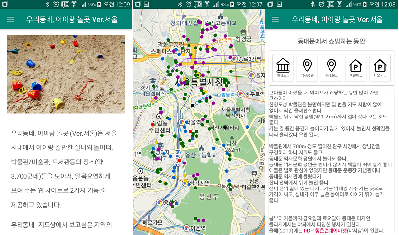

## 우리동네, 아이랑 놀곳 Ver.서울 ##

이 앱은 서울 시내 아이랑 갈만한 장소들을 모아서 보여 주는 웹 사이트 [Playground](http://playground.cafe24app.com/)의 안드로이드 버전이다.

웹 버전의 소스는 [여기에서](https://github.com/gujc71/Playground2) 확인 할 수 있다.

웹에서 데이터를 제공받아(Rest API), 보여주는 기능만 구현되어 있다. 

### FEATURES ###

- 우리 동네: 지정된 좌표(위도, 경도)를 중심으로 2Km 내의 시설/장소 정보 표시
- 추천 코스: 사용자가 특정 장소를 중심으로 갈만한 코스를 정리해서 소개

### Install & Run ###

- [웹 버전](https://github.com/gujc71/Playground2) 이 먼저 설치 되어야함
- git clone https://github.com/gujc71/playground_android.git
- 웹 서버의 주소를 RetrofitAPI.java 파일에 적절하게 지정
- AndroidManifest.xml 에 Daum Map API 키 입력
- run 

### License ###
GPLv3